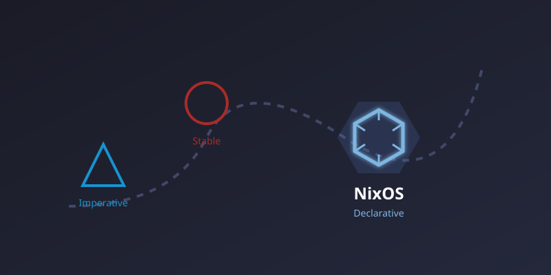

I ran Arch Linux for years because I wanted current packages, and FreeBSD alongside it because I wanted a system that stayed put. Both worked. Neither answered the question that kept costing me weekends: **when a machine breaks, how do I get the exact same machine back?**

On Arch, the honest answer was a wiki page of my own notes and some muscle memory. On FreeBSD it was a tarball of `/etc` and more muscle memory. Both are reconstruction from evidence, not reproduction from a source.

NixOS was the first system that let me answer that question with a command instead of a memory. This post is what I learned getting there — written for someone who has heard NixOS is interesting but hasn't yet worked out *why*.

## The one idea that makes NixOS click

Most Linux systems are built by *doing things to them*: install a package, edit a file in `/etc`, enable a service. The machine is the sum of everything you've ever done to it, and nothing records that history except you.

NixOS inverts this. You write a configuration file describing what the machine should be, and NixOS builds a machine matching it. The installed system is the *output* of that description, the way a compiled binary is the output of source code.

A few terms will keep coming up. They sound intimidating but the ideas are simple:

- **Derivation** — a build recipe. "Take these inputs, run these steps, produce this output."
- **Store path** — where a build result lives, under `/nix/store/`, in a directory whose name contains a hash of every input that produced it. Change any input and you get a different path. Nothing is ever overwritten in place.
- **Closure** — a complete built system plus everything it depends on, all the way down. When people say "the closure," they mean "the whole thing, with nothing missing."
- **Flake** — a project with a lockfile pinning its exact inputs, so it evaluates the same way on any machine, today or next year. Same idea as `package-lock.json` or `Cargo.lock`.

Two consequences follow, and they're the whole reason I stayed:

**Rebuilds are diffs, not migrations.** Changing your configuration builds a *new* system alongside the old one, then flips a symlink to activate it. Nothing is edited in place. If the new one is broken, the old one is still there and still bootable — it's an entry in your boot menu. Rolling back a bad upgrade is picking the previous entry, not restoring a backup.

**"Works on my machine" stops being a category.** Because the lockfile pins every input to an exact revision, the system my laptop builds and the system a server builds from the same configuration are identical — the same store paths, byte for byte.

## From bare metal to running host, unattended

The test I care about is the cold one: a machine with nothing on it but a minimal NixOS ISO. One command drives the whole path:

1. **Disko partitions the disks** from a declarative layout. No `fdisk`, no manual `mkfs`, and no drift between machines that are supposed to be identical.
2. **A minimal base installs**, with the SSH host key provisioned as part of the install rather than generated ad hoc afterward.
3. **The configuration builds**, either on the machine itself or offloaded elsewhere (more on that below).
4. **The system activates**, and the host comes up as exactly what the repository says it is.

Zero to a fully configured host in minutes, repeatably. The first time I rebuilt a server this way instead of restoring it from backup, my disaster-recovery plan stopped being a document and became a command.

That covers machines you can boot from an ISO. **kexec** covers the ones you cannot: it boots straight into a new kernel from the running system, so an existing Linux box can be taken over in place and come back up as NixOS. `medo`, the server this blog runs on, is a DigitalOcean droplet created from an Ubuntu image and converted without ever attaching install media or rebuilding it from the console.

Two more paths remove the remaining manual work. **PXE boot** lets a machine install itself over the network: power it on, it fetches the installer, and comes up configured — no console, no USB stick. And when the network itself is what died, a **cold recovery USB** carries both the installer and the small service that serves it, so a laptop can rebuild a hypervisor from bare metal with nothing else running. I cover how that works, and why segmented production networks make it harder than it sounds, in the [next post](../introducing-nxd/).

## The hard part: building on machines that can't build

Here's the practical problem nobody warns you about. Building a NixOS system takes real memory — Nix has to *evaluate* your whole configuration into a build plan before it compiles anything, and evaluation alone can want more RAM than a small VM has.

So on a small server you get an out-of-memory kill partway through, and no system at all.

The fix is realizing that **evaluation and compilation don't have to happen where the system runs**. Four strategies, and choosing correctly is the difference between "updating this takes an hour and might fail" and "updating this takes as long as the file transfer":

**Build on the target.** The machine builds its own system. Right for bare metal with cores and RAM to spare.

**Build on a builder.** A dedicated, powerful machine compiles the system, then ships only the finished result over SSH. The weak machine compiles nothing; it receives completed files. This is what makes updating a Raspberry Pi practical.

**Evaluate on the orchestrator, realize on the target.** The subtle one, and my favourite. Your workstation does the memory-hungry evaluation, then the *target* assembles the result into its own store. The small machine never has to hold the build plan in memory, but the finished system still gets built where it lives — no large transfer needed.

**Cross-compile.** Build an ARM64 system on an x86_64 workstation.

That third strategy is what makes 1 GB machines genuinely manageable. Both `medo` — the 1 GB cloud server this blog is served from — and its 1 GB test twin run with low-memory mode enabled, which automatically selects evaluate-here-realize-there instead of asking the target to do work it cannot finish.

This page is the example. The blog, the project site, and the manual are each built into a store path, and the web server's document root *is* that path, declared in the same configuration that defines the machine. Publishing is not a copy or an upload — it is a system rebuild, atomic and rollback-able like any other, with no deploy script and no drift between what the repository says is served and what is.

One correction worth recording, because I had it backwards for a while: evaluating locally on macOS is a mitigation for *memory pressure*, not a speedup. Local evaluation is slower than evaluating on a Linux builder. It's the right default only when the alternative is being OOM-killed.

## Secrets that survive a public repository

Everything above is worthless if the repository can't be public, and it can't be public if secrets live in it. The rule I settled on: **secrets are encrypted at rest with SOPS/age, decrypted at runtime, and never written into the Nix store.**

That last clause is the one people miss. The Nix store is world-readable by design — any user on the machine can read any store path. So a secret passed into a build is a secret published to everyone on that box, and permanently baked into a hash.

The working pattern: configuration files carry *references* to secrets, never values. Decryption happens at activation time, into memory or into files readable only by root. Git holds ciphertext. The store holds nothing sensitive.

## Keeping it maintainable past a few hosts

Structure here isn't aesthetic — it's what stops the configuration collapsing under its own weight:

- **Per-host directories** hold only what is genuinely specific to one machine: hardware, disk layout, role.
- **Shared modules** hold reusable service definitions, imported by whichever hosts need them. Configure Nginx once, use it five times.
- **Overlays** patch or pin individual packages without forking all of nixpkgs.
- **The lockfile** pins every input to an exact revision, so a deployment six months from now resolves to the same source it does today.

## What NixOS doesn't solve

Here's the wall I hit. Every host was now declarative. But those hosts *run on* something — Proxmox hypervisors, VMware guests, the coordination server for my private network, a backup appliance. **None of that is described by a NixOS configuration.**

So the hypervisor got configured by clicking through a web UI. Network nodes were enrolled by hand, and cleaned up by hand, badly. Backup jobs lived in an interface whose settings existed nowhere in Git. I had a perfectly reproducible operating system sitting on a completely undocumented foundation — and when I lost a hypervisor node, none of my NixOS rigor helped me rebuild it.

Terraform and Ansible are the usual answer, and they fit awkwardly: a second tool, a second state model, and a gap between "the machine" and "everything underneath it" that drifts precisely because nothing describes both.

Closing that gap is what I spent the following year building. The next post introduces **[NXD](../introducing-nxd/)** — a reconciliation engine that pulls hypervisors, private networking, backup servers, and OS updates into one Nix-authored dependency graph.
