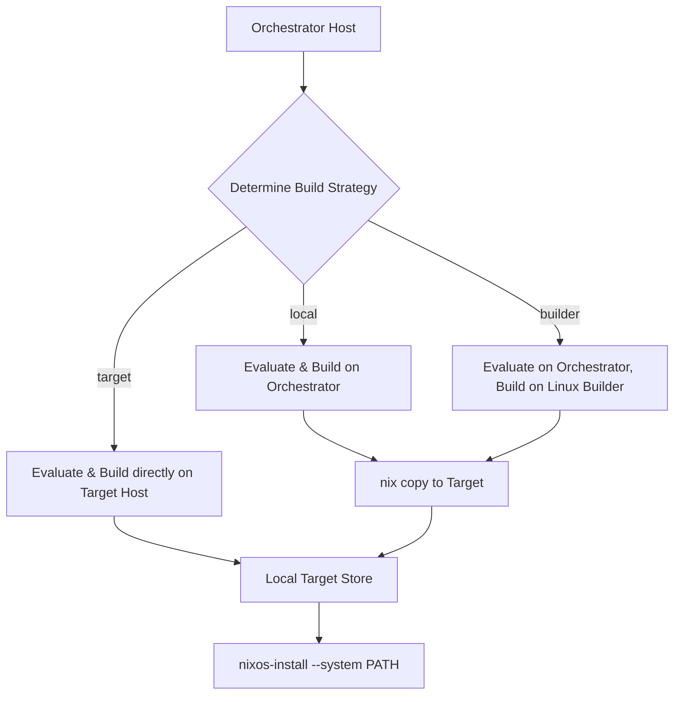
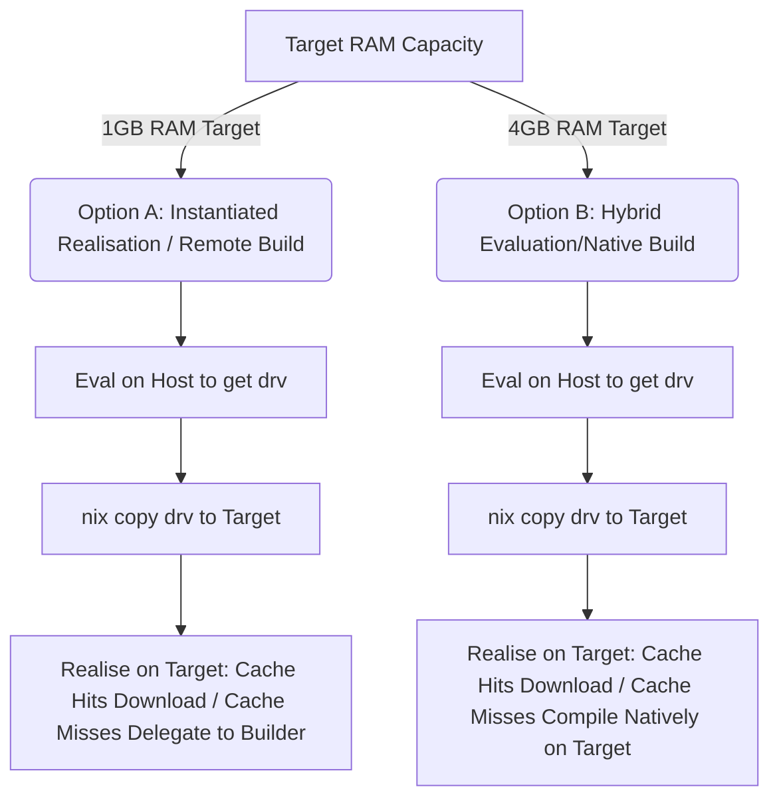
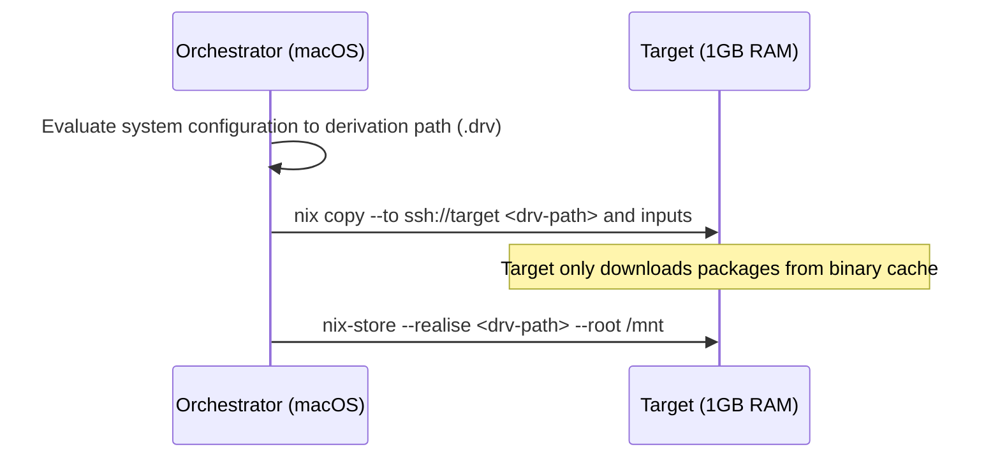
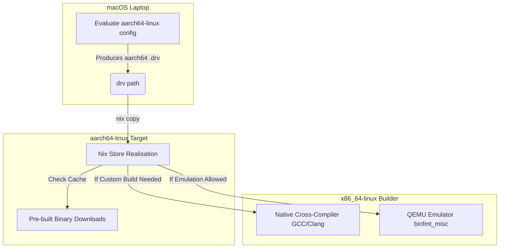
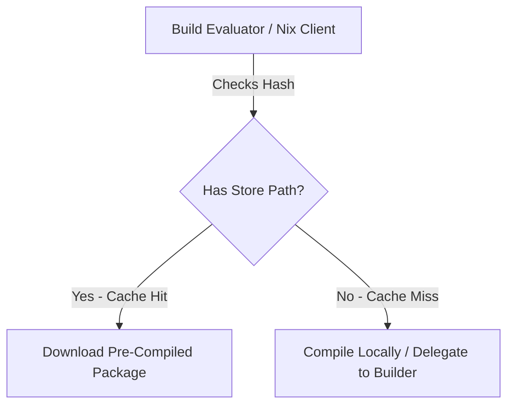

# NixOS Low-Memory Installation Strategies & Workflows

This document outlines the architecture, constraints, and solutions for deploying NixOS system configurations to RAM-constrained target environments (specifically 1GB and 4GB RAM hosts) using the upcoming `installer-rs` deployment orchestrator.

---

## 1. Core Architecture: Nix Workflows & Build Strategies

The `installer-rs` orchestrator resolves Nix builds into three primary strategies based on architecture, environment constraints, and configuration settings:



### Strategy Summary:

1. **`local` (Natively on Orchestrator):** Best if orchestrator OS matches target OS (e.g. Linux x86_64 to Linux x86_64).
2. **`builder` (Remote Linux Host):** Best if orchestrator is macOS (Darwin) or has low performance, delegating to a central Linux daemon.
3. **`target` (On target itself):** Fallback when no other Nix environment exists. The orchestrator merely syncs the config repository and issues `nix build` commands over SSH.

---

## 2. Why Target-Side 1-Stage Builds OOM on 1GB RAM

When `STRATEGY = target` is activated, running a single-stage install directly builds the target system configuration on itself. This fails due to two distinct memory bottlenecks:

### 2.1 The Evaluation Bottleneck (Nix Daemon RAM)

- Nix evaluates configurations lazily but constructs a massive syntax and dependency tree in memory.
- Evaluating a modular NixOS configuration (containing imports, disk layouts, overlays, and system settings) typically consumes **1.5GB to 2.5GB of RAM** during the evaluation phase alone.
- On a 1GB system, this immediately triggers the Linux kernel OOM killer during evaluation, before compilation even begins.

### 2.2 The Build Bottleneck (Compiler RAM)

- If any package (e.g., a custom package, kernel module, or driver override) is missing from the public binary cache, Nix compiles it from source on the target.
- Standard compilers (like Rustc, Gcc, or GHC) easily consume 1GB+ per build core. Even when limited to `--cores 1 --max-jobs 1`, compilation on 1GB RAM is extremely fragile.

---

## 3. Why Overlays Do Not Solve the Evaluation Bottleneck

While overlays customize package builds (reducing compiler RAM by selecting lighter dependencies), **they do not reduce Nix evaluation memory**. The Nix daemon must still parse and resolve the entire flake input graph to generate the derivation recipes (`.drv` files). The overhead of importing `nixpkgs` modules remains at 1.5GB+ of RAM.

---

## 4. Deployment Workflow Comparison

The table below contrasts the standard target-build strategy with the instantiation (`nix-store --realise`) strategy:

| Metric                   | Standard Way (`nix build` on Target)          | Instantiated Way (`nix-store --realise`)                  |
| :----------------------- | :-------------------------------------------- | :-------------------------------------------------------- |
| **Evaluation Host**      | Target (1GB/4GB RAM)                          | Orchestrator (macOS/Linux Laptop)                         |
| **Evaluation RAM**       | **1.5GB - 2.5GB (OOM on 1GB)**                | **0 MB on Target** (Offloaded to Host)                    |
| **Target Build Action**  | Parses, evaluates, and compiles/substitutes   | Instantly downloads pre-compiled outputs or runs compiler |
| **Transferred Assets**   | Full Git configuration repository (~MBs)      | Pre-computed `.drv` file (recipe) & source inputs         |
| **Distributed Builders** | Evaluates locally, then delegates compilation | Bypasses local evaluation entirely                        |

---

## 5. Target Deployment Workflows by RAM Capacity

Depending on the hardware capabilities of the target host, different workflows should be prioritized:



### 5.1 Solution A: Remote Evaluation & Build + Nix Copy (Recommended)

This approach offloads both evaluation and building entirely to the orchestrator (or remote builder), and simply transfers the finished output to the target.

```mermaid
sequenceDiagram
    participant O as Orchestrator (macOS/Linux)
    participant B as Builder (if macOS host)
    participant T as Target (1GB RAM)

    rect rgb(30, 40, 50)
        Note over O,B: No evaluation or compilation occurs on Target
    end
    O->>B: (Optional) Delegate build
    B-->>O: Return store path
    O->>T: nix copy --to ssh://target?root=/mnt <system-toplevel>
    Note over T: Negligible RAM used (~100MB)
    O->>T: nixos-install --system /mnt/nix/store/...
```



- **Why it is recommended over Solution B:** Solution A performs **both evaluation and package compilation/downloads** on the orchestrator or build server. The target host only receives the final pre-compiled binaries over SSH. This results in **absolute minimum resource consumption** (near 0% CPU and 0 MB build memory) on the target host.
- **Benefits:**
  - Fast execution (under 1 minute if using a high-speed network).
  - Safe 1-stage deployment.

### 5.2 Solution B: Remote Evaluation (Instantiation) + Target Realization

If the orchestrator is macOS and **does not** have a local Linux VM or remote Linux builder, it can still evaluate the configurations natively because Nix evaluation is platform-independent.



- **How it works:**
  1. The orchestrator evaluates the system derivation path locally:
     ```bash
     nix path-info --derivation .#nixosConfigurations.targetHost.config.system.build.toplevel
     ```
  2. The orchestrator copies the `.drv` file and its inputs to the target.
  3. The target realizes the derivation path directly.
- **Benefits:**
  - The memory-intensive Nix evaluation (~2GB RAM) happens on the orchestrator.
  - Target handles cache hits and compiles custom cache misses (or delegates them if a builder is configured).

### 5.3 Solution C: Increase ZRAM Swap Space Pre-Partitioning

If we are forced to evaluate and build natively on the target (e.g. bootstrapping from a local source tree on target with no remote network access), we must increase virtual memory.

- **How it works:**
  - Configure a **3GB or 4GB ZRAM swap** during the takeover phase:
    ```bash
    echo 4294967296 > /sys/block/zram0/disksize  # 4GB ZRAM
    ```
  - Once the disk partitioning runs, immediately initialize and enable a **4GB physical swap file** on `/mnt/swapfile` _before_ evaluating the system configuration build.
- **ZRAM Swap Tuning:** The `installer-rs` orchestrator dynamically initializes a 3GB ZRAM swap (`init_zram_swap`) on the target. However, for 1GB RAM targets, 1GB of swap is often insufficient to prevent OOM when evaluating or compiling modern complex configurations directly on the target. Setting ZRAM swap to 3GB–4GB (which ZRAM compresses with a ~3:1 ratio, using only ~1GB of physical RAM when fully packed) is necessary for safety.

---

## 6. Cross-Platform Flow (macOS Orchestrator → x86 Builder → aarch64 Target)

When deploying an `aarch64-linux` target from a macOS Darwin laptop using a remote `x86_64-linux` builder:



---

## 7. Nix Binary Caching: How it Works

A **Binary Cache** is an HTTP/SSH server containing pre-compiled store paths. Instead of compiling source code locally, Nix checks these caches for matching cryptographic hashes of derivations and downloads the built packages.



### 7.1 The Official NixOS Cache (Hydra)

- **Hydra** is the official NixOS continuous integration (CI) farm. It continuously evaluates the official channels (like `nixos-unstable` or `nixos-23.11`) and builds every package for all supported platforms (including `x86_64-linux` and `aarch64-linux`).
- The compiled outputs are uploaded to **`cache.nixos.org`** (backed by a global CDN).
- **For standard configurations:** Any package that uses standard, unmodified settings from your channels is downloaded from this cache, resulting in a **Cache Hit**.

### 7.2 Custom Caches (For Overlays and Custom System Builds)

If you write custom configurations, packages, or overlays, their cryptographic derivation hashes will change. They will not be present in `cache.nixos.org` and will result in a **Cache Miss**. You can solve this by hosting a custom cache:

1. **Attic (Self-Hosted - Recommended):**
   - Attic is a modern, self-hosted binary cache for Nix. You can host it on a central server (e.g. `utils`).
   - When you build a system on your builder or developer laptop, you push the built paths to Attic.
   - Target hosts configure your Attic URL in `nix.settings.substituters` to pull pre-built custom derivations.
2. **Cachix (Hosted SaaS):**
   - A third-party hosted cache. You can push your custom compilations to Cachix, and target hosts pull them from there.
3. **SSH Store Copy (Ad-hoc Cache):**
   - You can configure a target host to pull files directly from another machine's local store over SSH:
     ```nix
     nix.settings.substituters = [ "ssh://deploy@utils" ];
     nix.settings.trusted-public-keys = [ "utils-cache-key.pub" ];
     ```
   - When the target realizes a derivation, it queries `utils` over SSH. If `utils` has already compiled it, the target copies the store paths directly.

---

## 8. Implementation Recommendations for `installer-rs`

To support these optimizations natively in the Rust-based orchestrator, implement the following features:

1. **Low-Memory Strategy Router:**
   If `deployment.lowMem = "yes"` is set, or if the orchestrator detects memory constraints, the orchestrator should automatically select the **Instantiated Realisation** flow (Solution B) rather than executing target-side `nix build` commands.
2. **Dynamic Swap Configuration:**
   During the kexec takeover phase, configure a **3GB ZRAM swap** on the target. Immediately after partition formatting, initialize a **3GB physical swapfile** on `/mnt/swapfile` before executing any Nix commands.
3. **Target Nix Environment Tuning:**
   Wrap all target Nix execution commands with memory-limiting flags:
   ```bash
   GC_INITIAL_HEAP_SIZE=1M GC_DONT_GC=1 NIX_DISABLE_AUTO_GC=1 nix-store --realise <drv-path> --cores 1 --max-jobs 1
   ```
